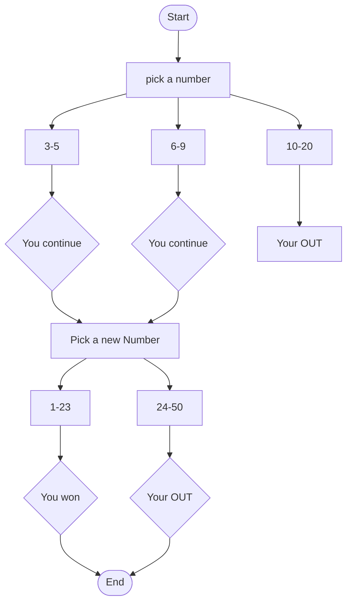

```mermaid
flowchart TD
Start([Start]) --> User[pick a number] --> L1[3-5] & L2[6-9] & L3[10-20]
L1 --> A1{You continue}
L2 --> A2{You continue}
L3 --> A3[Your OUT]
A1 & A2 --> Q1[Pick a new Number]
Q1 --> A4[1-23] & A5[24-50]
A4 --> Answer{You won}
A5 --> Answer2{Your OUT}
Answer & Answer2 -->End([End])


```